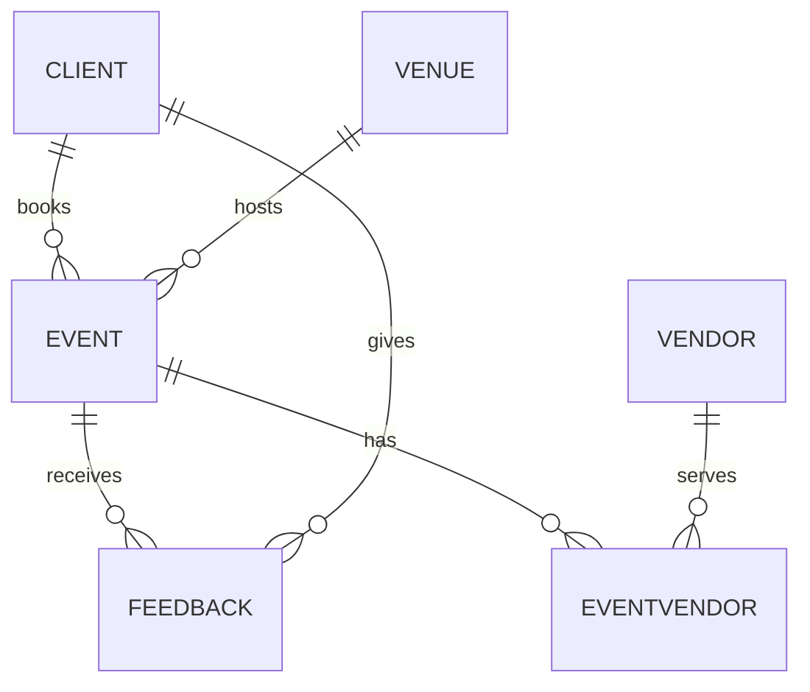

# 🎉 EventForce Management System – Salesforce CRM


## 📌 Overview

The **EventForce Management System** streamlines event-planning operations using custom objects, automation, and analytics. It gives event coordinators real-time visibility into events, reduces manual work, and keeps data accurate through validation and security controls.

> Built in a **Salesforce Developer Edition Org** for academic purposes, following real-world CRM implementation practices.

## 🎯 Objectives

- Streamline client bookings, venue reservations, vendor coordination, and feedback collection.
- Reduce manual processes by **60%** through automated workflows.
- Improve booking efficiency by **40%** by preventing double bookings.
- Improve client satisfaction with timely automated reminders.
- Provide data-driven insights through reports and dashboards.

## ✨ Key Features

- 6 custom objects with Lookup, Master-Detail, and Many-to-Many relationships
- Validation rules for data quality (e.g., email format check)
- **Approval Process** for event cancellation requests
- **3-Day Reminder Flow** that emails clients before their event
- Apex class and trigger for venue availability and double-booking prevention
- Nightly Batch + Schedulable Apex job to mark past events as *Completed*
- Custom **Lightning App** (Event Planner)
- Role-based security with profiles, roles, permission sets, and sharing rules
- Reports and an operations dashboard

## 🗂 Data Model

| Object | API Name | Key Fields |
|---|---|---|
| Event | `Event__c` | Event Name, Event Date, Event Type, Event Status, Event Budget |
| Client | `Client__c` | Client Name, Email, Phone, Address, Country, City |
| Vendor | `Vendor__c` | Vendor Name, Email, Phone, Service Type, Status |
| Venue | `Venue__c` | Venue Name, Address, Location (URL), Capacity, Availability Status |
| Feedback | `Feedback__c` | Feedback ID (Auto Number), Rating, Comments |
| Event Vendor | `EventVendor__c` | Junction object linking Event ↔ Vendor |

**Relationships**

| Relationship | Type |
|---|---|
| Event → Client | Lookup |
| Event → Venue | Lookup |
| Feedback → Event | Lookup |
| Feedback → Client | Lookup |
| EventVendor → Event | Master-Detail |
| EventVendor → Vendor | Master-Detail |



## ⚙️ Automation

| Component | Name | Purpose |
|---|---|---|
| Record-Triggered Flow | 3-Day Reminder Flow | Emails the client 3 days before a *Confirmed* event |
| Approval Process | Event Cancellation Approval | Routes cancellation requests with email notifications |
| Validation Rule | `Email_Valid_Address` | Ensures a valid client email format |
| Apex Class | `VenueStatusHelper` | Sets venue to *Reserved* on booking, *Available* on cancellation |
| Apex Trigger | `PreventDoubleBooking` | Blocks two events at the same venue on the same date |
| Batch Apex | `BatchCompleteEvents` | Marks past events as *Completed* |
| Schedulable Apex | `ScheduleCompleteEvents` | Runs the batch job daily at 8:00 PM |

## 🔐 Security Model

- **Profiles:** Event Admin, Event Coordinator, Vendor Manager, Client Profile
- **Roles:** Event Admin (top) → Event Coordinator, Vendor Manager, Client
- **Permission Set:** Feedback Manager (Read / Create / Edit / Delete on Feedback)
- **OWD:** Event object set to *Private*
- **Sharing Rule:** `Event_Sharing_For_Vendors` shares Event Coordinator records with Vendor Manager (Read Only)

## 🧭 Project Phases

| Phase | Description |
|---|---|
| 1 | Requirement Analysis & Planning |
| 2 | Backend Development & Configurations (objects, tabs, fields, validation, approval, flows, Apex) |
| 3 | UI/UX Development & Customization (Lightning App, reports, dashboards) |
| 4 | Data Migration, Testing & Security (profiles, roles, users, permission sets, sharing) |
| 5 | Deployment, Documentation & Maintenance |

## 📁 Repository Structure

```
EventForce-Salesforce/
├── force-app/
│   └── main/default/
│       ├── objects/          # Custom objects and fields
│       ├── classes/          # VenueStatusHelper, BatchCompleteEvents, ScheduleCompleteEvents
│       ├── triggers/         # PreventDoubleBooking
│       ├── flows/            # 3-Day Reminder Flow
│       ├── approvalProcesses/
│       ├── profiles/
│       ├── permissionsets/
│       └── reports/ dashboards/
├── docs/
│   ├── EventForce_Project_Documentation.docx
│   └── screenshots/
├── sfdx-project.json
└── README.md
```


## 📝 Deployment Note

All work was built and tested in a **Developer Edition Org**, which is a standalone environment. A real production deployment would use sandboxes, change sets, or DevOps tools such as GitHub CI/CD pipelines and Salesforce DX. This project simulates that process by keeping metadata structured, version-controlled, and ready for migration.

## 📚 Learnings

- Designing data models with lookup, master-detail, and junction relationships
- Automating processes with flows, approvals, and Apex
- Securing data with profiles, roles, permission sets, and sharing rules
- Building reports and dashboards for decision-making
- Preparing a solution for deployment, maintenance, and documentation


⭐ If you found this project helpful, consider giving it a star!
